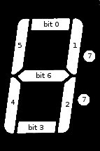

# TM1637 Arduino Library

[AliExpress: TM1637] (https://ru.aliexpress.com/wholesale?SearchText=TM1637)

## Basic methods
* `init()`																Initializes the display
* `display(uint8_t BitAddr,int8_t DispData)`							Displays the symbol
* `displayAscii(uint8_t BitAddr,char DispChar)` 						Displays the character
* `displayNumeral(uint8_t BitAddr,uint8_t DispNumeral)`					Displays the Numeral
* `displayWord(String Str)`												Display the word of 4 characters
* `displayTemp(int Temp)` 												Display  the temperature in Celsius (is -99 to 999 )
* `displayNumber(int Num, char Filling=' ')`							Display number (is -999 to 9999 )
* `displayClock(byte Hours, byte Minutes, boolean Colon=false)`			Display Clock (HOURS:MINUTES). Colon - changes the sign ":"
* `displayStopwatch(byte Minutes, byte Seconds, boolean Colon=false)`	Display Stopwatch (MINUTES:SECONDS). Colon - changes the sign ":"
* `clearDisplay()														Clear display
* `setColon(boolean colonFlag)`											Enables or disables the sign ":"
* `changeColon()` 														Changes the sign ":" (enables or disables)
* `setBright(uint8_t sBright=2)`										Set bright (0..3)

## Advanced methods
* `writeByte(int8_t wr_data)`											Write 8bit data to TM1637
* `start(void)`															Send start bits
* `stop(void)`															Send stop bits

# Описание на русском

Эта библиотека позволяет очень просто использовать семи сегментный дисплей из четырех символов и одного двоеточия,основанный на TM1637

## Основные методы
* `init()`																Инициализация дисплея
* `display(uint8_t BitAddr,int8_t DispData)`							Вывод произвольного символа DispData (основанного на битовой маске) в указанном разряде BitAddr 
* `displayAscii(uint8_t BitAddr,char DispChar)` 						Вывод ascii символа (есть не все символы)
* `displayNumeral(uint8_t BitAddr,uint8_t DispNumeral)`					Вывод цифры DispNumeral в указанном разряде BitAddr
* `displayWord(String Str)`												Вывод слова из четырех символов
* `displayTemp(int Temp)` 												Вывод температуры в градусах цельсия (от -99 до 999 )
* `displayNumber(int Num, char Filling=' ')`							Вывод числа (от -999 до 9999 )
* `displayClock(byte Hours, byte Minutes, boolean Colon=false)`			Вывод часов (Часы:Минуты). Если Colon установленно в true то меняет отображение ":" на противоположное
* `displayStopwatch(byte Minutes, byte Seconds, boolean Colon=false)`	Вывод секундомера (Минуты:Секунды). Colon аналогично, предыдущему
* `clearDisplay()`														Очищает дисплей
* `setColon(boolean colonFlag)`											Включает или выключает знак ":"
* `changeColon()` 														Меняет на противоположный знак ":" (Включает или выключает)
* `setBright(uint8_t sBright=2)`										Устанавливает яркость (0..3)

## Расширенные методы (смотрите в исходниках)
* `writeByte(int8_t wr_data)`											Записывает 8bit данных в TM1637
* `start(void)`															Посылает start bits
* `stop(void)`															Посылает stop bits

